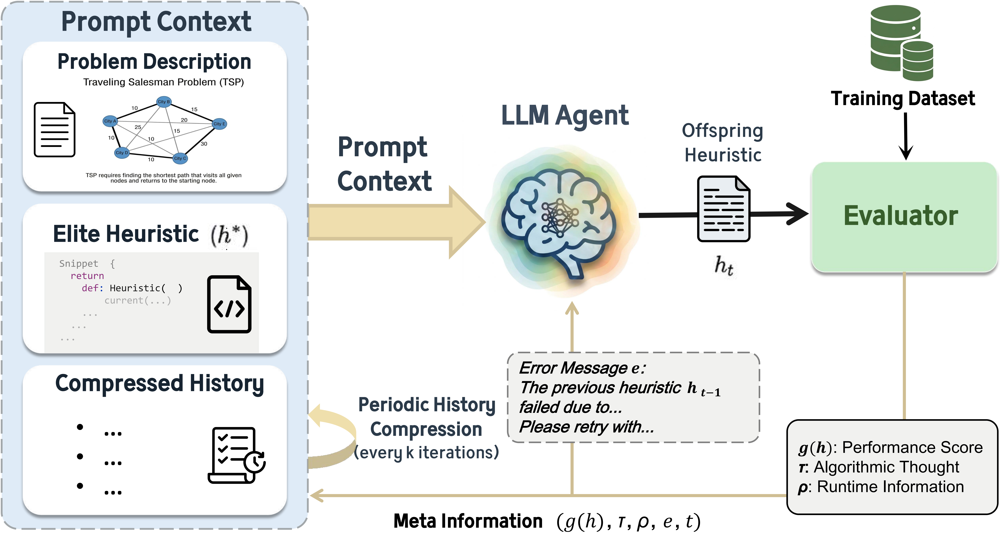
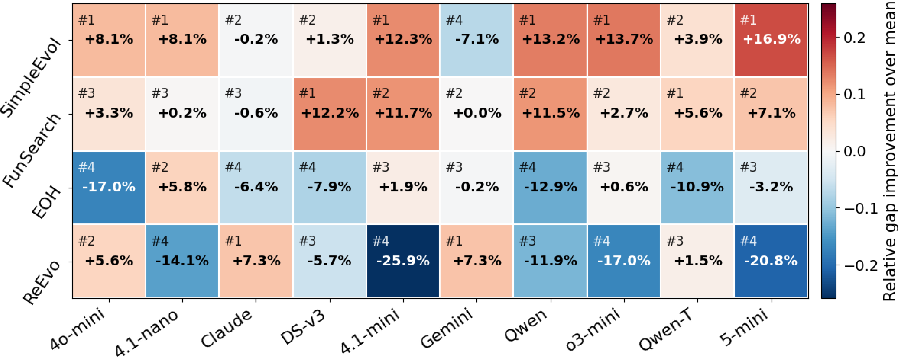
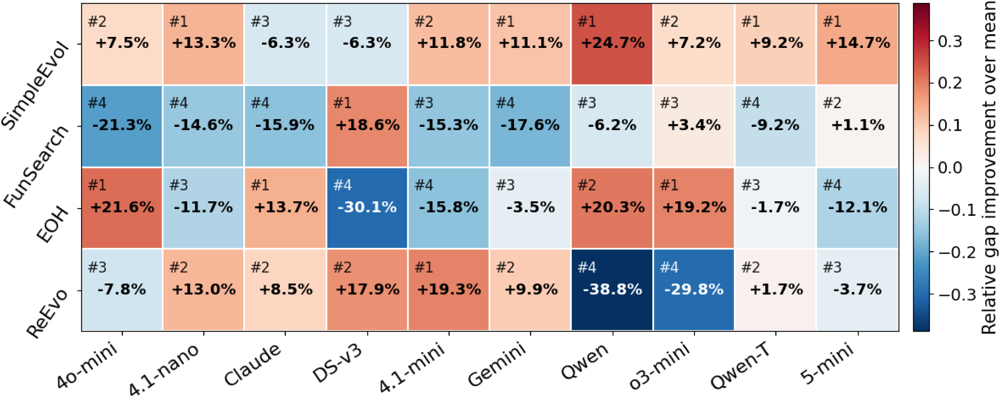

# [NeurIPS 2026] SimpleEvol: An Agent-Loop Framework for LLM-Driven Automated Heuristic Design with Minimal Human Priors

## Framework

SimpleEvol is a lightweight LLM-driven framework for automatic heuristic design that maintains a single evolving search trajectory instead of a population with predefined mutation and crossover operators. At each iteration, the LLM generates a candidate heuristic and a concise description, while an evaluator measures its performance on training instances and returns objective values, runtime information, and any execution errors. Periodic history compression turns the accumulated feedback into compact working notes and retains the best-so-far heuristic in the prompt context, allowing the agent to build on previous discoveries without a separate planner or reflection module. This design shifts the emphasis from handcrafted search operators to a lightweight information interface that supports the LLM's own heuristic exploration.



*SimpleEvol combines a generation-and-evaluation loop with best-so-far retention and compressed search history.*

## Advantages over FunSearch, EoH, and ReEvo

Under the paper's common budget of 820 heuristic evaluations, SimpleEvol combines a simpler search framework with strong performance across ten backbone LLMs. It achieves the highest intelligence conversion efficiency (ICE, the fitted slope of performance against the model-intelligence proxy) among these four methods on both TSP Constructive and CVRP-ACO: **2.1941 on TSP** and **6.2128 on CVRP**, compared with **1.8174** and **5.4381** for the strongest baseline by ICE, FunSearch. The model-wise comparisons below show that this advantage is also reflected in direct performance rankings, rather than only in regression slopes.

Each column compares the four methods using the same backbone. The upper-left label gives the rank by average gap, while the percentage and color show relative gap improvement over the four-method mean for that backbone. Positive values indicate a lower, better gap than that mean; they are not pairwise improvements over a particular baseline.

**TSP Constructive.** SimpleEvol ranks first on **6 of 10 backbones** and among the top two on **9 of 10**, the most first-place finishes among the four methods. With GPT-5-mini, it achieves a **16.9% relative gap improvement over the four-method mean**. The paper additionally reports the lowest test gap among the four methods at all three tested sizes with this backbone: **4.77%, 6.47%, and 9.49%** for N=50, 100, and 200, respectively.



**CVRP-ACO.** SimpleEvol ranks first on **5 of 10 backbones** and among the top two on **8 of 10**, again achieving the most first-place finishes. Its relative gap improvement over the four-method mean reaches **24.7% with Qwen3-Instruct** and **14.7% with GPT-5-mini**. With GPT-5-mini, it also achieves the lowest test gap at every tested size: **0.34%, 4.31%, and 4.26%** for N=50, 100, and 200. Together, these results demonstrate competitive model-wise performance and stronger fitted scaling within the evaluated tasks, backbones, and budget.



This README describes the current implementation and configuration, not a guarantee of reproducing every published result.

## Installation

Run commands from the directory containing `main.py` and `requirements.txt`. The project uses Python 3.10+ syntax. Linux is recommended for experiments because evaluator timeouts use Unix signals.

```bash
python -m pip install -r requirements.txt
```

Dependencies include NumPy, SciPy, PyTorch, Numba, Hydra, tqdm, and the OpenAI SDK. A GPU is not required; the CVRP ACO solver uses the CPU by default. FSSP requires Numba, even when the other two tasks already import successfully.

## Configure an LLM

The available client configurations are `openai` and `openrouter`, under `cfg/llm_client/`. Use `llm_client.model` to select a model. Do not use the legacy top-level `model` override: some branches reference clients not included in this repository.

### OpenAI

Set your API key in the environment:

```bash
# Linux / macOS
export OPENAI_API_KEY="YOUR_API_KEY"
```

```powershell
# Windows PowerShell
$env:OPENAI_API_KEY = "YOUR_API_KEY"
```

Then run:

```bash
python main.py algorithm=simple_evol problem=tsp_constructive llm_client=openai llm_client.model=gpt-4o-mini
```

### OpenRouter

Set `OPENROUTER_API_KEY` in the same way, then override the key configuration with an environment-variable reference:

```bash
python main.py algorithm=simple_evol problem=tsp_constructive llm_client=openrouter llm_client.model=openai/o3-mini 'llm_client.api_key=${oc.env:OPENROUTER_API_KEY}'
```

Alternatively, set the following in `cfg/llm_client/openrouter.yaml`:

```yaml
api_key: ${oc.env:OPENROUTER_API_KEY}
```

Do not commit real API keys or put them directly in command-line overrides. Inspect configuration files and generated logs before sharing them. API access, model availability, and charges depend on your provider and account.

The current OpenRouter adapter forwards its `reasoning` configuration only for model names containing `thinking` or `step-3.5`. Setting `reasoning.enabled=true` alone does not guarantee that this field is sent for other model names.

## Run the supported problems

The following commands use the OpenAI client. Replace its configuration with the OpenRouter options above when needed.

```bash
python main.py algorithm=simple_evol problem=tsp_constructive llm_client=openai
python main.py algorithm=simple_evol problem=cvrp_aco llm_client=openai
python main.py algorithm=simple_evol problem=fssp_gls llm_client=openai
```

| Problem | Candidate function | Training data used by the default configuration | Final test data |
|---|---|---|---|
| `tsp_constructive` | `select_next_node` | 64 synthetic instances, N=50 | 64 instances per size, N=50, 100, 200 |
| `cvrp_aco` | `heuristics` | 10 synthetic instances, N=50 | 64 instances per size, N=50, 100, 200 |
| `fssp_gls` | `get_matrix_and_jobs` | 16 synthetic instances, 50 jobs | All 110 Taillard instances in `TestingData/` |

FSSP's `n_instances: 16` controls training only. Its `test_n_instances: 10` is not a total-test cap: the evaluator reads every instance from all 11 Taillard files. The current synthetic training count differs from the 64 training instances described in the paper; the table above intentionally reports the code's current setting.

### Search settings

Defaults in `cfg/config.yaml`:

```yaml
max_experiments: 820
compress_every: 5
enable_test_eval: False
timeout: 60
```

- `max_experiments`: number of generated candidates evaluated by the main loop, not the number of LLM calls. Summaries and format retries require additional calls. FSSP also evaluates its seed as experiment 0.
- `compress_every`: number of evaluated candidates between context compressions; zero disables compression.
- `enable_test_eval`: enables intermediate test evaluations in addition to training. Keep this disabled for held-out testing: when enabled, test scores are included in the current feedback implementation.
- `timeout`: total time allowed for one heuristic evaluation across the training instances, not a fresh budget for every instance.

For a shorter exploratory run:

```bash
python main.py problem=tsp_constructive llm_client=openai max_experiments=5 compress_every=5
```

This still calls a real LLM and performs final testing. It is not an offline test.

FSSP additionally has an internal GLS loop limit of 1000 iterations and 60 seconds per instance, subject to the outer per-heuristic timeout. The final test evaluation uses a separate 3600-second total timeout. On Windows, `SIGALRM` is unavailable, so the hard evaluator timeout is not enforced; FSSP's loop clock cannot interrupt a candidate that hangs inside a function call.

## Datasets

The main evaluators load data relative to their source directories, independently of Hydra's run directory.

- **TSP:** `problems/tsp_constructive/data/`. Missing datasets are generated automatically with reproducible, separate random streams for training, validation, and testing. Existing files are preserved; insufficient instance counts produce an error rather than silently using fewer instances.
- **CVRP:** `problems/cvrp_aco/data/`. The evaluator calls its generator when default dataset files are missing. The generator produces training, validation, and test files; invoking it may overwrite existing generated datasets.
- **FSSP:** synthetic training files are under `problems/fssp_gls/data/` and are generated if no training files exist. Existing files are reused. Taillard test files must remain under `problems/fssp_gls/TestingData/`; the synthetic generator does not recreate that benchmark.

To generate datasets manually from the project root:

```bash
python -m problems.tsp_constructive.gen_inst
python -m problems.cvrp_aco.gen_inst
python -m problems.fssp_gls.gen_inst
```

The FSSP generator defaults to creating 64 synthetic files, but the training evaluator still uses only the number specified by `problem.n_instances`. Back up existing CVRP/FSSP generated data before invoking their generators if it must be preserved.

## Scores and outputs

All three tasks minimize their objective:

- TSP training: mean tour length. Final testing reports a mean for each size and their arithmetic average as `obj`.
- CVRP training: mean route length from ACO with 30 ants and 100 iterations. Final testing reports size-wise means and their arithmetic average. ACO sampling is stochastic.
- FSSP training: mean makespan. Final testing reports the mean percentage gap to the Taillard upper-bound references. Training and test `obj` therefore have different units for FSSP.

Evaluation results contain `obj`, `time`, `error`, and `details`. Failed evaluations may return `obj=None`; inspect errors rather than treating every completed attempt as a successful score.

Hydra stores each run under:

```text
simple_evol_outputs/<problem_name>-<problem_type>/<date>_<time>/
    .hydra/
    <job-name>.log
    experiment_records/
        exp_001.txt
        ...
```

FSSP also records `exp_000.txt` for the seed. Each experiment record contains the candidate code, description, objective, timing, and errors. Working candidate files are stored in `problems/<problem>/llm_temp/`; the final selected code is saved in `problems/<problem>/best_candidates/`. Final test scores are logged by `main.py`.

`main.py` uses each problem's `eval.py` for both training and final testing, not `eval-test.py`. It does not compute ICE; these outputs are objective measurements for downstream analysis.

## Scope and limitations

- Launch from the project root: `main.py` captures the initial working directory as its root before Hydra changes directories.
- This README covers `algorithm=simple_evol`. A FunSearch implementation is also present, but its behavior is not validated by these instructions.
- Other problem configuration names may exist without corresponding implementations; use the three tasks listed above.
- The standalone TSP `eval-test.py` currently contains import errors and is not part of the documented main workflow.
- Local import checks or mocked client tests do not verify live API connectivity, candidate validity, or end-to-end reproduction of published results.
